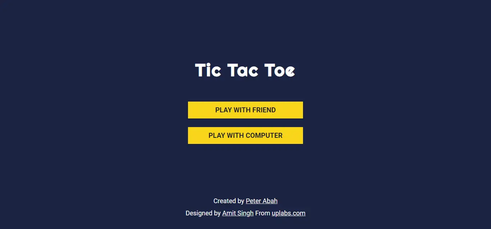
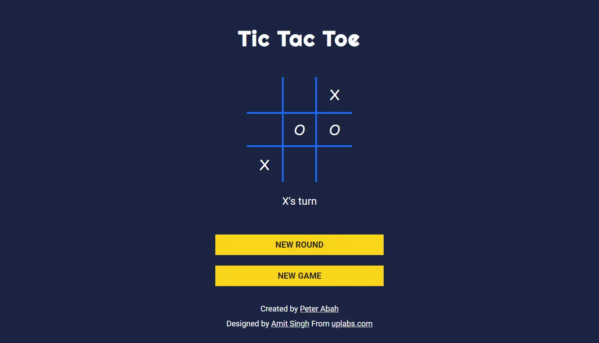
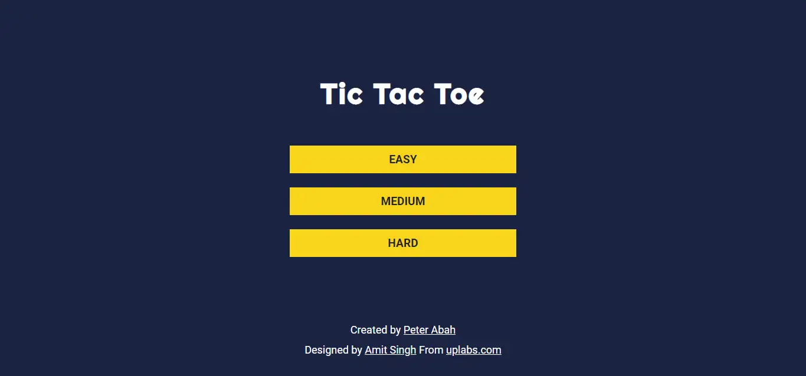

# Tic Tac Toe
This is a browser version of the Tic Tac Toe. Players can play against themselves or play against the computer. The project is part of [The Odin Project's curriculum](https://www.theodinproject.com/paths/full-stack-ruby-on-rails/courses/javascript/lessons/tic-tac-toe-javascript).

[Live Preview](https://peter-abah.github.io/tic-tac-toe)

# Overview
## Screenshots

## Built with
- HTML
- CSS
- SCSS
- JavaScript

## Features
- Users can play against each other
- Users can play against computer which has three game modes.
  - Easy: The computer randomly selects a valid move
  - Medium: The computer selects a winning move if there is one, or a move to prevent the opponent from winning. If none of those moves exist, it selects a random move.
  - Hard: The computer uses minimax algorithm to select the best possible move. **Not done yet**
- Users can watch the computer play against itself. *Not done yet*.

# What I learnt
- The purpose of the project to to use factory functions and module pattern to organise the code. I tried to follow the pattern although I don't know if I got it right.
- I learnt about the PubSub pattern and used it for the communication between the various modules in the code.

# Useful Resources
- [Learning JavaScript Design Patterns By Addy Osmani](https://addyosmani.com/resources/essentialjsdesignpatterns/book/)

# Acknowledgements
- [The Odin Project](https://www.theodinproject.com)
- Design by [Amit Singh](https://www.uplabs.com/amit3200) from [uplabs.com](https://www.uplabs.com)